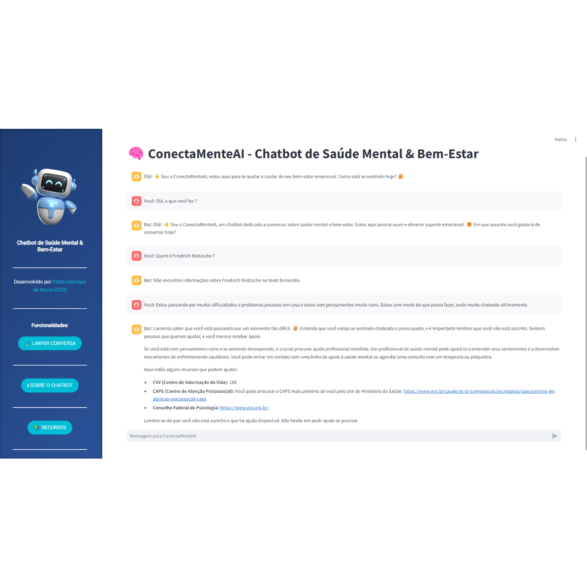

# 🧠 ConectaMenteAI - Mental Health & Well-Being Chatbot

O projeto **ConectaMenteAI** tem como objetivo fornecer suporte emocional e promover o bem-estar mental usando técnicas de processamento de linguagem natural (NLP) e Deep Learning. Ele permite que os usuários façam perguntas relacionadas à saúde mental por meio de um chatbot que processa o conteúdo de documentos PDF sobre saúde mental e bem-estar.



## Table of Contents

- [Overview](#overview)
- [Architecture](#architecture)
- [Dataset](#dataset)
- [Installation](#installation)
- [Configuration](#configuration)
- [Project Structure](#project-structure)
- [Emotional Support Chatbot](#emotional-support-chatbot)
- [Environment Variables](#environment-variables)
- [Dependencies](#dependencies)
- [Conclusion](#conclusion)

## Overview

**ConectaMenteAI** implementa um chatbot que processa PDFs relacionados à saúde mental e responde de forma empática às perguntas dos usuários. O sistema usa **Streamlit** para a interface do usuário, a **Google Generative AI API** para a geração de respostas e bibliotecas de aprendizado de máquina como **scikit-learn** para criar embeddings que permitem a busca semântica nos textos dos PDFs.

Principais recursos do projeto incluem:

1. Processamento de documentos PDF relacionados à saúde mental.
2. Criação e busca de embeddings em textos extraídos dos PDFs.
3. Oferecimento de respostas em tempo real focadas no bem-estar emocional.

## Architecture

A arquitetura do ConectaMenteAI consiste nos seguintes componentes principais:

- **Processamento de PDFs**: O conteúdo dos PDFs de saúde mental é extraído e dividido em segmentos menores.
- **Criação de Embeddings**: **TfidfVectorizer** é usado para criar representações vetoriais dos textos extraídos.
- **Busca Semântica**: Com base nos embeddings, o sistema encontra o texto mais relevante em resposta às consultas dos usuários.
- **Geração de Respostas**: As respostas são geradas usando o modelo **Gemini** da API generativa da Google, incorporando o contexto do PDF.

## Dataset

O conjunto de dados para este projeto consiste em uma coleção de PDFs sobre temas de saúde mental, incluindo ansiedade, depressão, inteligência emocional e guias práticos de saúde mental. Esses arquivos são armazenados localmente e processados para busca e extração de informações.

### Fontes dos PDFs

1. **CartilhaSaudeMentalUFLA.pdf**  
   [Boas Práticas de Saúde Mental - Universidade Federal de Lavras (UFLA)](https://ufla.br/noticias/institucional/13561-ufla-lanca-cartilha-sobre-saude-mental)

2. **Depressao.pdf**  
   [Depressão: Causas, Sintomas e Tratamentos - Ministério da Saúde](http://saude.gov.br/saude-de-a-z/depressao)

3. **E-book-ansiedade.pdf**  
   [Ansiedade: Características e Técnicas de Alívio - Universidade Federal de Santa Maria (UFSM)](https://repositorio.ufsm.br/bitstream/handle/1/23750/A619%20%20Ansiedade.pdf)

4. **inteligenciaemocional.pdf**  
   [Inteligência Emocional no Ambiente de Trabalho - Portal Sebrae](https://www.sebrae.com.br/sites/PortalSebrae/artigos/inteligencia-emocional-como-ela-pode-te-ajudar-a-ser-mais-produtivo,9b31f0c707d7b610VgnVCM1000004c00210aRCRD)

5. **saudemental.pdf**  
   [Saúde Mental e Trabalho no Judiciário - Conselho Nacional de Justiça (CNJ)](https://www.cnj.jus.br/wp-content/uploads/2020/04/Saude-Mental-CNJ.pdf)

6. **saudementalalberteinsten.pdf**  
   [Saúde Mental - Hospital Albert Einstein](https://www.einstein.br/saudemental)

7. **saudementalharvard.pdf**  
   [Saúde Mental na Universidade de Harvard](https://globalhealth.harvard.edu/files/hghi/files/mental_health.pdf)

8. **saudementalparaadolescentes.pdf**  
   [Saúde Mental para Adolescentes - UNICEF](https://www.unicef.org/brazil/media/5731/file)

**Ferramentas Utilizadas**:

- **Streamlit**: Interface para o chatbot e sistema de busca.
- **Google Generative AI**: Para gerar respostas contextuais com base nas perguntas dos usuários.
- **scikit-learn**: Para criar embeddings de texto e realizar buscas semânticas.

## Installation

1. **Clone o repositório**:

    ```bash
    git clone https://github.com/your_username/conectamenteai.git
    cd conectamenteai
    ```

2. **Crie um ambiente virtual**:

    ```bash
    python3 -m venv .venv
    source .venv/bin/activate  # No Windows: .venv\Scripts\activate
    ```

3. **Instale as dependências**:

    ```bash
    pip install -r requirements.txt
    ```

## Configuration

Antes de executar o projeto, configure as seguintes variáveis de ambiente no arquivo `.env`:

```bash
GOOGLE_API_KEY=your_google_api_key
```

## Emotional Support Chatbot

Execute o chatbot:

```bash
streamlit run app.py
```

## Environment Variables

```bash
GOOGLE_API_KEY=your_google_api_key
```

## Dependencies

```bash
pip install -r requirements.txt
```

## Conclusion

O projeto **ConectaMenteAI** oferece uma ferramenta robusta e acessível para fornecer suporte emocional e promover o bem-estar mental. Integrando processamento de linguagem natural, busca semântica e inteligência artificial generativa, este chatbot permite que os usuários acessem informações de saúde mental facilmente e recebam respostas empáticas. A arquitetura modular e o design de código aberto permitem futuras melhorias e personalizações, tornando-o um recurso valioso para iniciativas de saúde mental.

🧠💬 **Empoderando o bem-estar mental, uma conversa de cada vez!**
