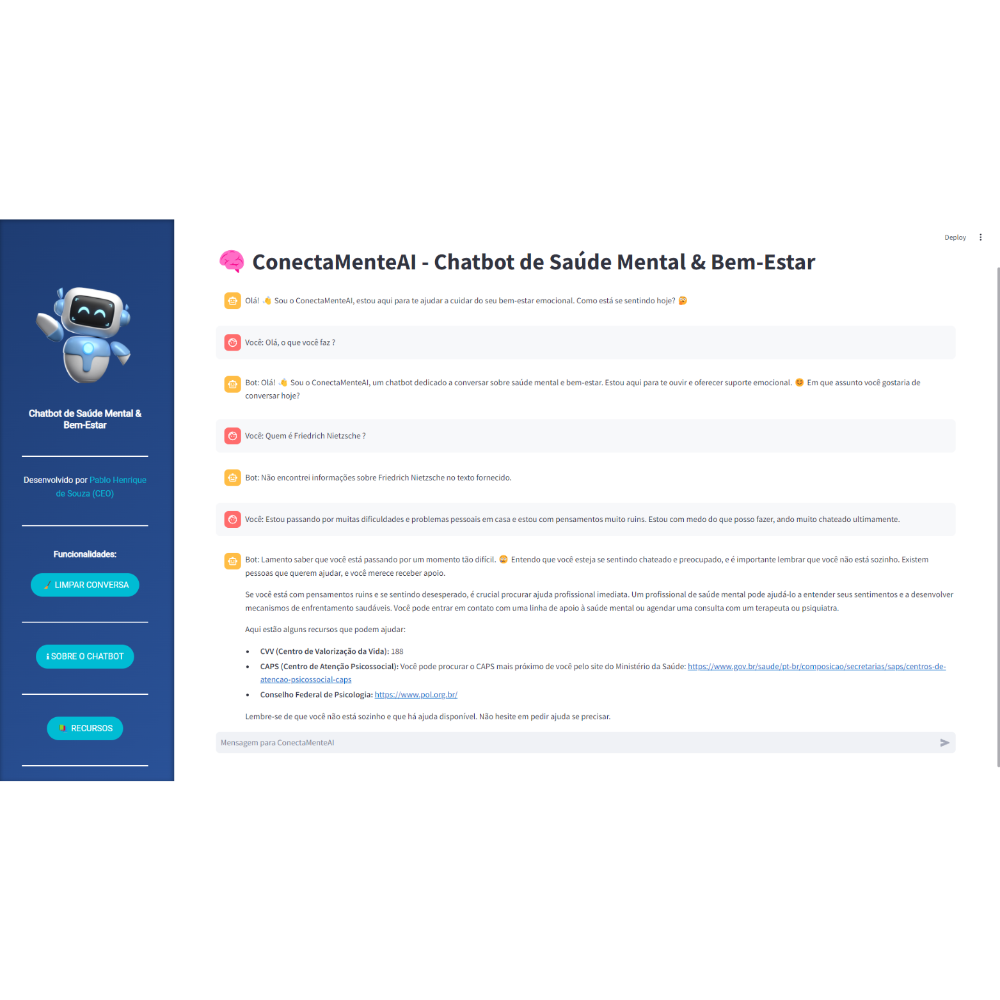

# 🧠 ConectaMenteAI - Mental Health & Well-Being Chatbot

The **ConectaMenteAI** project aims to provide emotional support and promote mental well-being using natural language processing (NLP) techniques and deep learning. It allows users to ask questions related to mental health through a chatbot that processes content from mental health and well-being PDF documents.



## Table of Contents
- [Overview](#overview)
- [Architecture](#architecture)
- [Dataset](#dataset)
- [Installation](#installation)
- [Configuration](#configuration)
- [Project Structure](#project-structure)
- [Emotional Support Chatbot](#emotional-support-chatbot)
- [Environment Variables](#environment-variables)
- [Dependencies](#dependencies)

---

## Overview

**ConectaMenteAI** implements a chatbot that processes mental health-related PDFs and responds empathetically to users' questions. The system uses **Streamlit** for the user interface, the **Google Generative AI API** for response generation, and machine learning libraries like **scikit-learn** to create embeddings that allow semantic search within the PDF texts.

Key features of the project include:
1. Processing mental health-related PDF documents.
2. Creating and searching embeddings in extracted PDF texts.
3. Offering real-time responses focused on emotional well-being.

## Architecture

The ConectaMenteAI architecture consists of the following main components:

- **PDF Processing**: The content of mental health PDFs is extracted and divided into smaller segments.
- **Embedding Creation**: **TfidfVectorizer** is used to create vector representations of the extracted texts.
- **Semantic Search**: Based on the embeddings, the system finds the most relevant text in response to user queries.
- **Response Generation**: Responses are generated using the **Gemini model** from Google's generative AI API, incorporating the context from the PDF.

## Dataset

The dataset for this project consists of a collection of PDFs on mental health topics, including anxiety, depression, emotional intelligence, and practical mental health guides. These files are stored locally and processed for search and information extraction.

### PDF Sources:

1. **CartilhaSaudeMentalUFLA.pdf**  
   [Mental Health Best Practices - Federal University of Lavras (UFLA)](https://ufla.br/noticias/institucional/13561-ufla-lanca-cartilha-sobre-saude-mental)

2. **Depressao.pdf**  
   [Depression: Causes, Symptoms, and Treatments - Ministry of Health](http://saude.gov.br/saude-de-a-z/depressao)

3. **E-book-ansiedade.pdf**  
   [Anxiety: Characteristics and Relief Techniques - Federal University of Santa Maria (UFSM)](https://repositorio.ufsm.br/bitstream/handle/1/23750/A619%20%20Ansiedade.pdf)

4. **inteligenciaemocional.pdf**  
   [Emotional Intelligence in the Workplace - Sebrae Portal](https://www.sebrae.com.br/sites/PortalSebrae/artigos/inteligencia-emocional-como-ela-pode-te-ajudar-a-ser-mais-produtivo,9b31f0c707d7b610VgnVCM1000004c00210aRCRD)

5. **saudemental.pdf**  
   [Mental Health and Work in the Judiciary - National Council of Justice (CNJ)](https://www.cnj.jus.br/wp-content/uploads/2020/04/Saude-Mental-CNJ.pdf)

6. **saudementalalberteinsten.pdf**  
   [Mental Health - Albert Einstein Hospital](https://www.einstein.br/saudemental)

7. **saudementalharvard.pdf**  
   [Mental Health at Harvard University](https://globalhealth.harvard.edu/files/hghi/files/mental_health.pdf)

8. **saudementalparaadolescentes.pdf**  
   [Mental Health for Adolescents - UNICEF](https://www.unicef.org/brazil/media/5731/file)

**Tools Used:**
- **Streamlit**: Interface for the chatbot and search system.
- **Google Generative AI**: To generate contextual responses based on user questions.
- **scikit-learn**: To create text embeddings and perform semantic searches.

## Installation

1. Clone the repository:
    ```bash
    git clone https://github.com/your_username/conectamenteai.git
    cd conectamenteai
    ```

2. Create a virtual environment:
    ```bash
    python3 -m venv .venv
    source .venv/bin/activate
    ```

3. Install the dependencies:
    ```bash
    pip install -r requirements.txt
    ```

## Configuration

Before running the project, configure the following environment variables in the `.env` file:

```bash
GOOGLE_API_KEY=your_google_api_key
```

These variables allow the system to access Google's generative intelligence API to generate responses based on the documents processed.

## Project structure

```bash
connectai/
│
├── src/
│ ├── demonstration-image/ # Project media files
│ │ └── conectamenteai.png
│ └── data/ # Mental health PDFs
│ ├── PrimerMentalHealthUFLA.pdf
│ ├── Depression.pdf
│ ├── E-book-anxiety.pdf
│ ├── emotional intelligence.pdf
│ ├── health.pdf
│ ├── saudementalalberteinsten.pdf
│ ├── saudementalharvard.pdf
│ └── saudementalparaadolescentes.pdf
│
├── modules/
│ ├── chat.py # Search functions and creation of embeddings
│ ├── pdf_processor.py # Processing PDFs
│ └── sidebar.py # Setting up the sidebar in Streamlit
│
├── utils/
│ └── text_splitter.py # Text splitting function for processing
│
├── app.py # Streamlit main file
├── config.py # Path to PDFs and other settings
├── requirements.txt # Python dependencies
├── .env # Environment variables (not included in the repository)
└── README.md # Project documentation
```

## Emotional Support Chatbot

To start the ConectaMenteAI chatbot, run the following command:


```bash
streamlit run app.py
```

The main script will:

- Load and process the PDFs stored locally.
- Generate embeddings of the PDF texts.
- Answer user questions based on the semantic answers found in the processed documents.

Steps:

1. Upload PDFs: The PDF files are processed and their texts extracted.
2. Semantic search: On receiving a question, the system finds the most relevant excerpt using embeddings.
3. Generated response: The Gemini model of the Google Generative AI API is used to formulate a contextualized and empathetic response.

Example output:

- Generated response: “Hi, I'm here to help you. What would you like to know about mental health?”

## Environment Variables

The following environment variables must be set in the .env file for the project to work correctly:

```bash
GOOGLE_API_KEY=your_google_api_key
```

## Dependencies

Make sure you have the following dependencies installed, which are listed in the `requirements.txt` file:

- Streamlit: For the chatbot interface.
- Google Generative AI: To generate answers based on user questions.
- Scikit-learn: For creating embeddings and semantic search.
- Python Dotenv: To load the environment variables from the `.env` file.

To install all the dependencies, run

```bash
pip install -r requirements.txt
```
